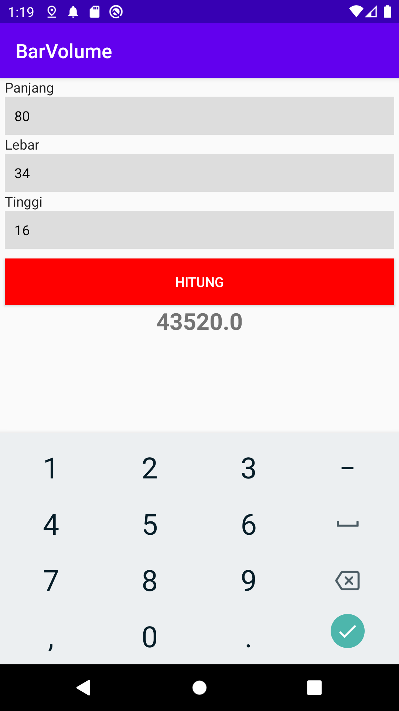
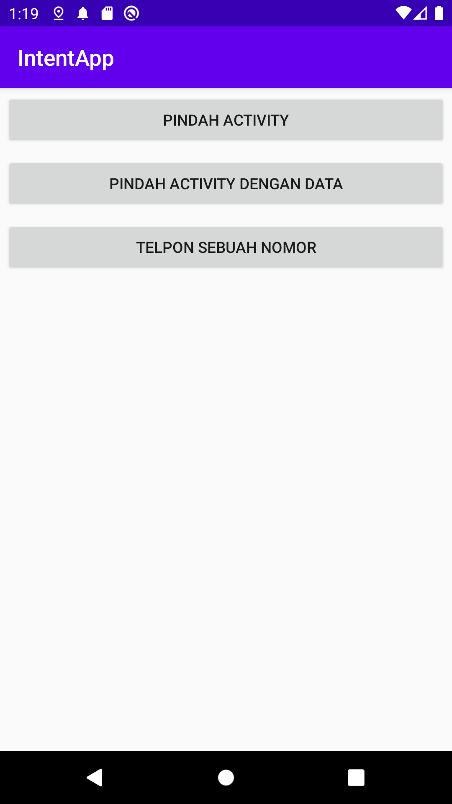
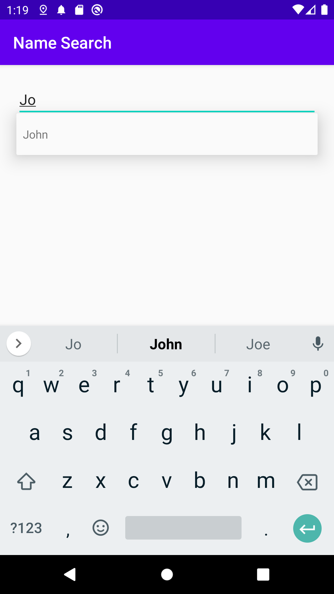
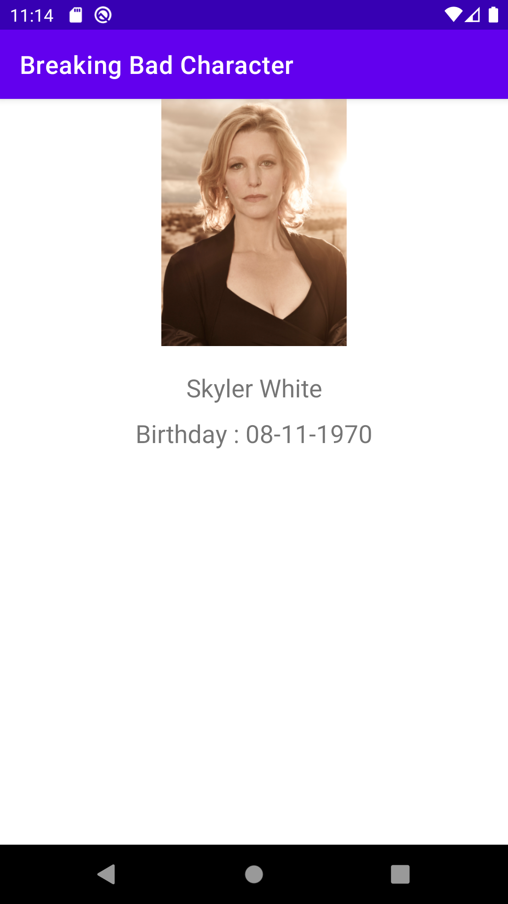
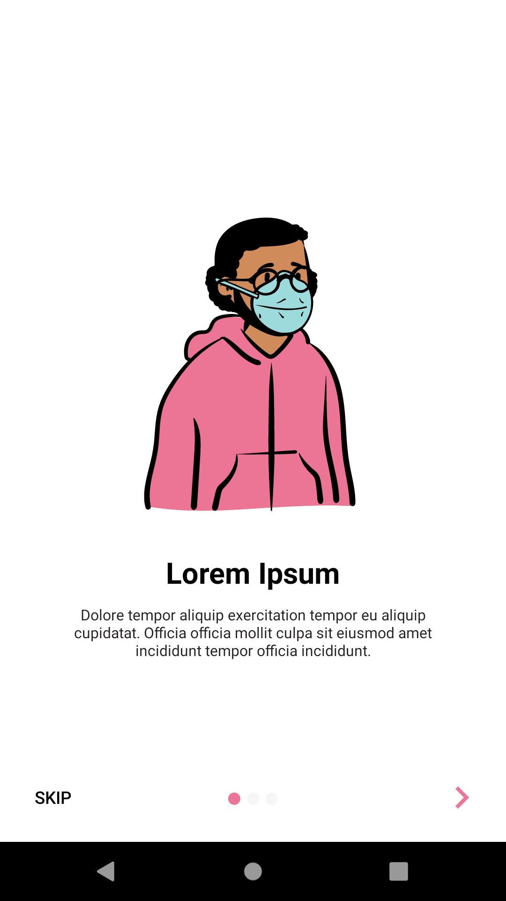
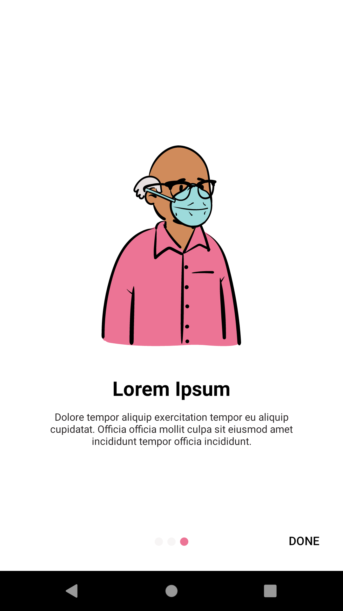
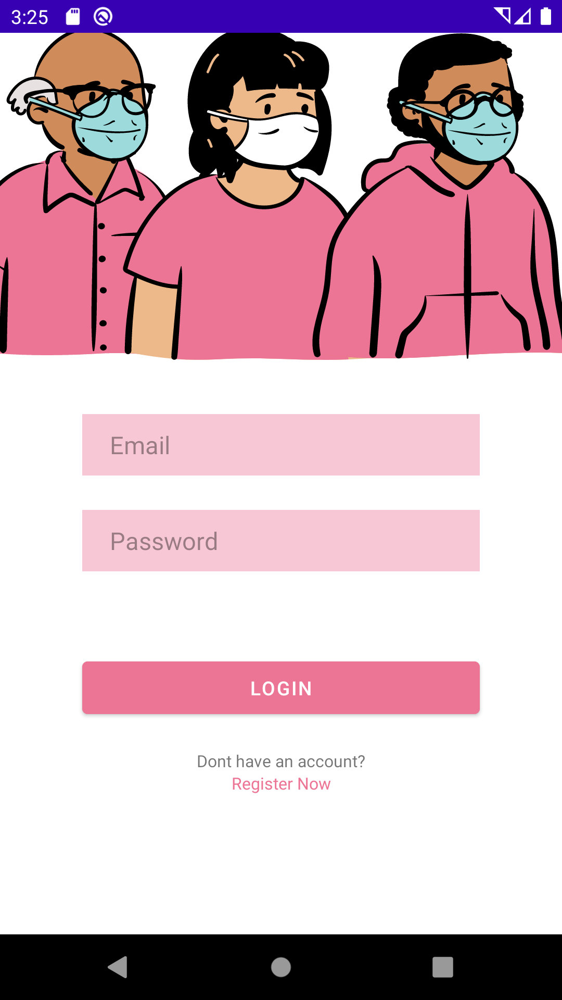

# LEARN ANDROID JAVA
This is my learning journey of android, i will add new app and some note in this repository. 

## Changelog
1. Bar Volume  
    
    - I Learn how to add component, getting value and setting value
2. Intent App  
    
    - I Learn how to make activity, android lifecycle, intent implicit & explicit
3. Smartphone Spec  
    
    - I Learn some layout like, LinearLayout, TableLayout, RelativeLayout and ScrollView
4. Pahlawan App  
    
    
    
    - I Learn How to use Recyclerview, Make an Adapter, Class Model, GridView and CardView
5. Name Search  
    
    - I Learn how to use AutoCompleteTextView
    - Using Adapter
6. Breaking Bad  
    
    
    - I Learn how to using Retrofit for fetch data from api
    - Passing response api data to adapter and to grid view
    - Using Progress Bar
    - Using SwipeRefresh Layout
7. Onboard App 
    
    
    
    - I learn how to using Intro App library for making onboard on application
    - I Learn how to making simple thread
8. News App (On Progress)  
    
    
    - I Learn how to use CardView
    - Implementing Interceptor for logging
    - Using Shimmer Layout